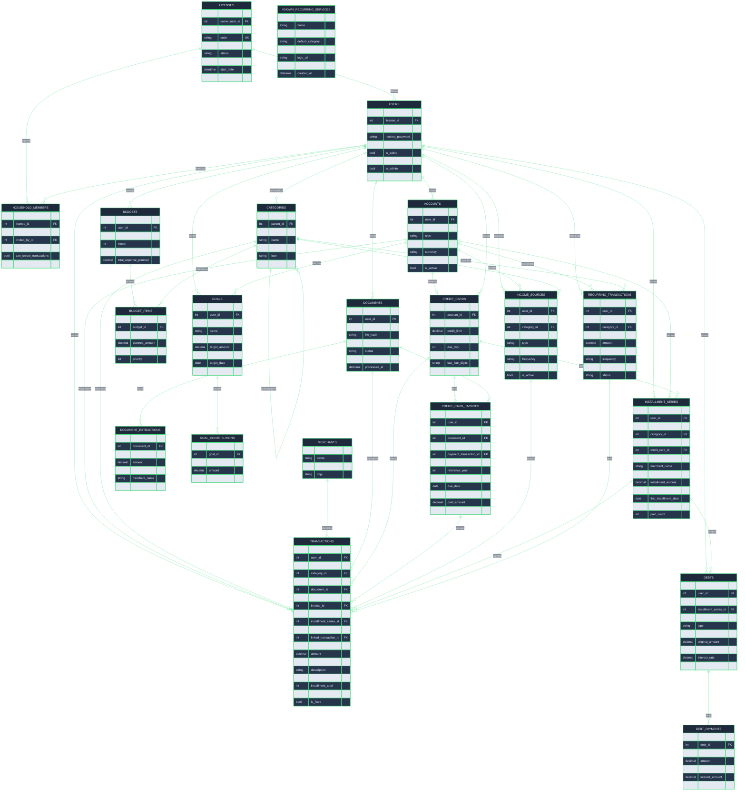
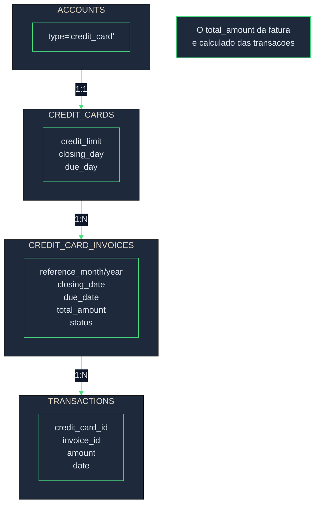
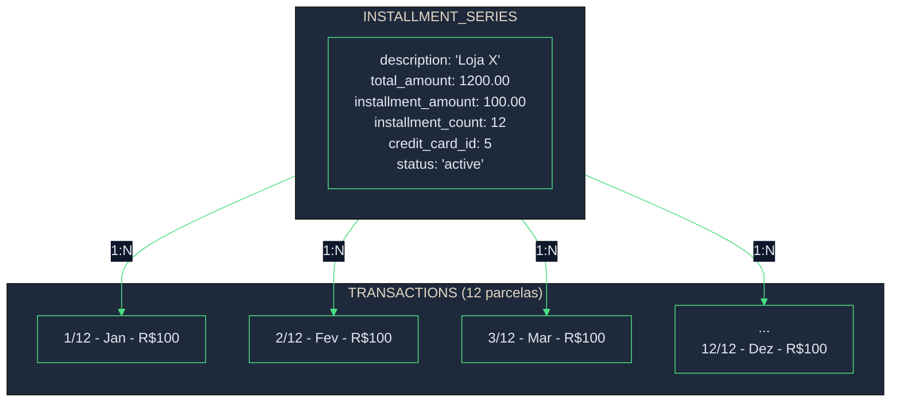
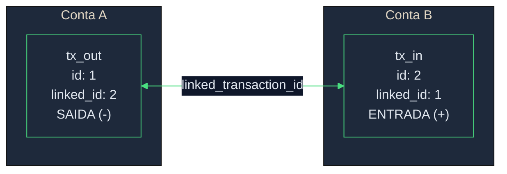
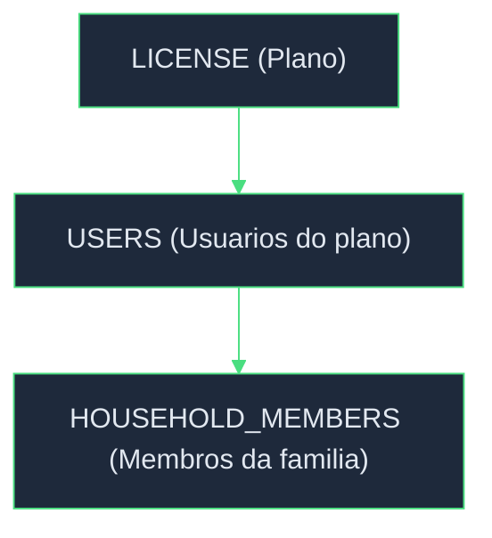
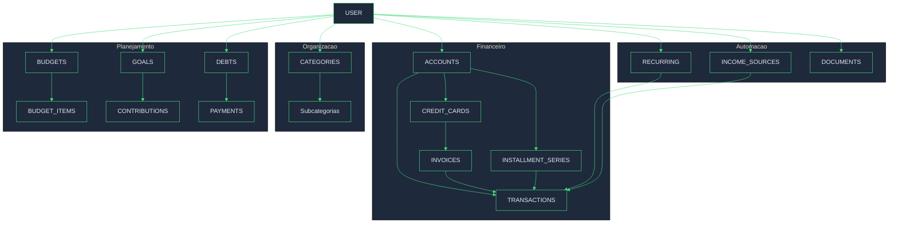

# Esquema do Banco de Dados

## Diagrama ER



---

## Fluxo Principal: Cartao de Credito



---

## Fluxo de Parcelas (Installments)



**Exemplo: Compra parcelada R$ 1.200 em 12x de R$ 100**

| Parcela | Data | Valor | Fatura |
|---------|------|-------|--------|
| 1/12 | 2025-01-15 | R$ 100 | Jan/2025 |
| 2/12 | 2025-02-15 | R$ 100 | Fev/2025 |
| 3/12 | 2025-03-15 | R$ 100 | Mar/2025 |
| ... | ... | ... | ... |
| 12/12 | 2025-12-15 | R$ 100 | Dez/2025 |

---

## Calculo de Saldos

### Conta Bancaria (bank/wallet)

```
Saldo = account.balance + SUM(transactions)

Onde:
  - income = +amount
  - expense = -amount
```

### Cartao de Credito

```
Limite Usado = SUM(transactions WHERE credit_card_id = X)
Limite Disponivel = credit_card.credit_limit - Limite Usado
Total da Fatura = SUM(transactions WHERE invoice_id = Y)
```

### Transferencia entre Contas



**Logica:**
- Se `id < linked_transaction_id` = SAIDA (subtrair)
- Se `id > linked_transaction_id` = ENTRADA (somar)

**Contas permitidas:** `wallet`, `bank`, `investment`
**NAO permitido:** `credit_card`

---

## Relacionamentos Principais

### Hierarquia de Usuarios



### Hierarquia Financeira



---

## Tipos e Status

### Account.type
| Valor | Descricao |
|-------|-----------|
| `wallet` | Carteira fisica |
| `bank` | Conta bancaria |
| `credit_card` | Cartao de credito |
| `investment` | Investimento |

### Transaction.type
| Valor | Descricao |
|-------|-----------|
| `income` | Receita |
| `expense` | Despesa |
| `transfer` | Transferencia entre contas |

### InvoiceStatus
| Valor | Descricao |
|-------|-----------|
| `open` | Aberta (acumulando) |
| `closed` | Fechada (aguardando pagamento) |
| `paid` | Paga |
| `partial` | Parcialmente paga |
| `overdue` | Vencida |

### InstallmentSeriesStatus
| Valor | Descricao |
|-------|-----------|
| `active` | Em andamento |
| `completed` | Todas pagas |
| `cancelled` | Cancelada |

### ownership_type
| Valor | Descricao |
|-------|-----------|
| `personal` | Pessoal |
| `household` | Compartilhada (familia) |

### RecurringTransaction.frequency
| Valor | Descricao |
|-------|-----------|
| `daily` | Diaria |
| `weekly` | Semanal |
| `monthly` | Mensal |
| `yearly` | Anual |

### RecurringTransaction.status
| Valor | Descricao |
|-------|-----------|
| `active` | Ativa |
| `paused` | Pausada |
| `cancelled` | Cancelada |
