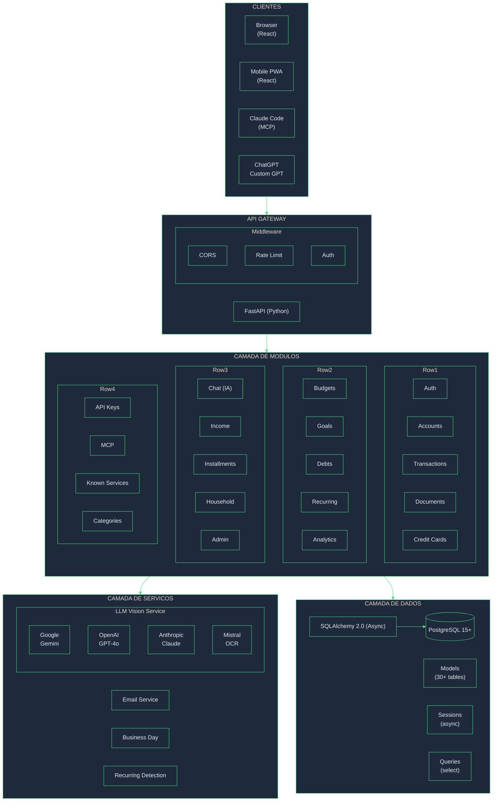
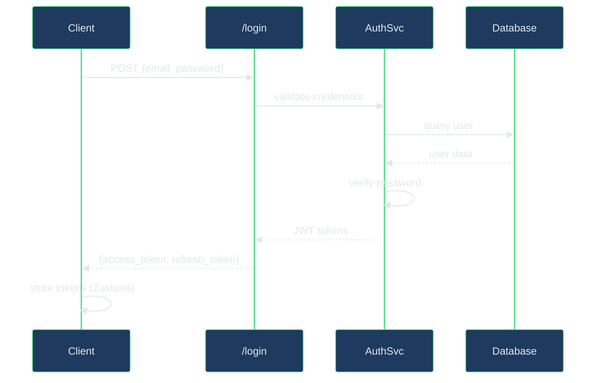
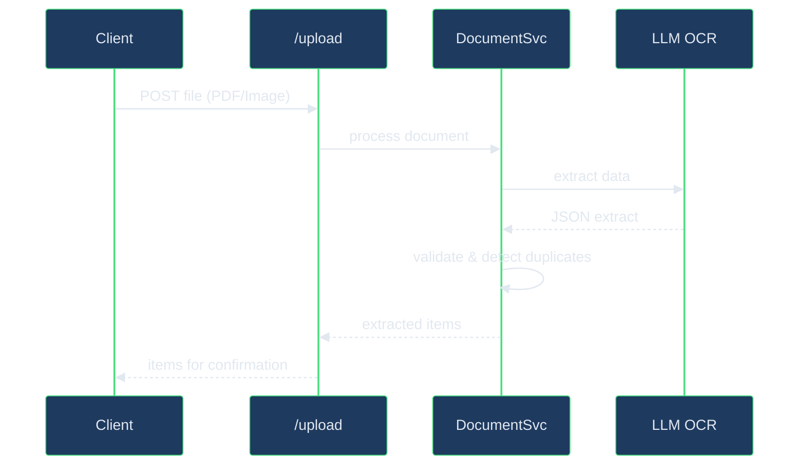
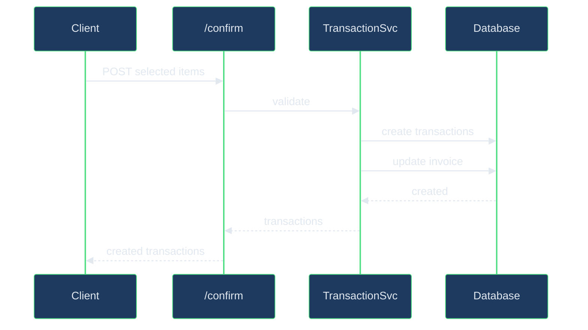
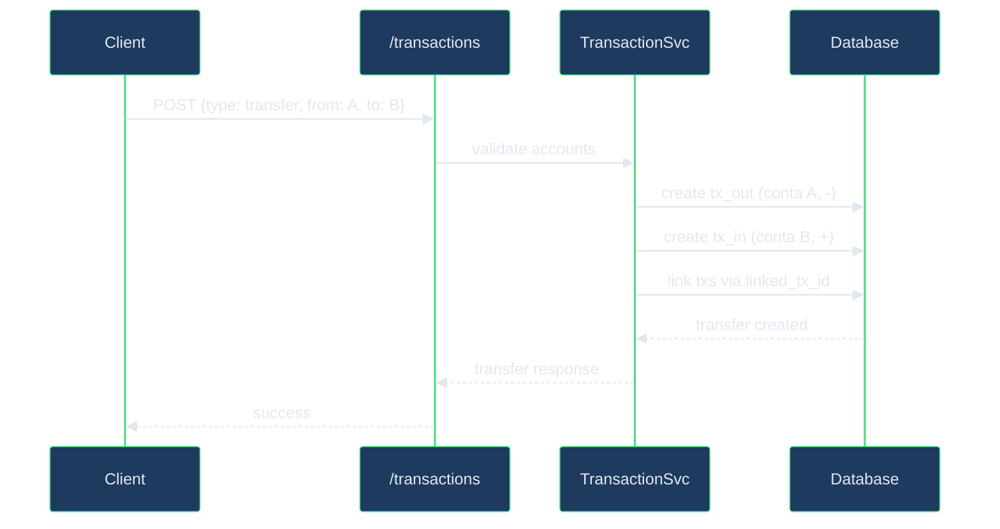

# Arquitetura do Sistema

## Visao Geral

O Biveto e uma aplicacao de gestao financeira pessoal construida com arquitetura moderna de monolit modular. O sistema e dividido em duas partes principais:

- **Backend**: API REST em Python com FastAPI
- **Frontend**: SPA em React com TypeScript

## Diagrama de Arquitetura



## Componentes do Sistema

### 1. Frontend (React SPA)

**Tecnologias:**
- React 18 com TypeScript
- Vite para build
- Tailwind CSS para estilos
- Zustand para estado global
- TanStack Query para cache de servidor
- React Router para roteamento

**Responsabilidades:**
- Interface de usuario responsiva
- PWA com suporte offline
- Gerenciamento de estado local
- Cache de dados do servidor
- Autenticacao via JWT

**Estrutura:**
```
frontend/src/
├── pages/          # 22 paginas/rotas
├── components/     # 18 componentes reutilizaveis
├── stores/         # 4 Zustand stores
├── services/       # Camada de API (Axios)
├── hooks/          # Custom hooks
├── types/          # Tipos TypeScript
└── schemas/        # Validacao Zod
```

### 2. Backend (FastAPI)

**Tecnologias:**
- Python 3.12
- FastAPI (async)
- SQLAlchemy 2.0 (async)
- Pydantic v2 para validacao
- JWT para autenticacao
- Alembic para migracoes

**Responsabilidades:**
- API REST
- Autenticacao e autorizacao
- Logica de negocios
- Integracao com LLMs
- Persistencia de dados

**Estrutura:**
```
app/
├── core/           # Config, security, deps
├── models/         # 30+ SQLAlchemy models
├── modules/        # 20 modulos de features
│   ├── auth/
│   ├── transactions/
│   ├── documents/
│   └── ...
└── main.py         # Entry point
```

### 3. Banco de Dados (PostgreSQL)

**Principais Entidades:**

| Entidade | Descricao |
|----------|-----------|
| `users` | Usuarios do sistema |
| `licenses` | Licencas (free, premium, family) |
| `accounts` | Contas bancarias e carteiras |
| `transactions` | Transacoes financeiras |
| `categories` | Categorias (sistema + usuario) |
| `credit_cards` | Cartoes de credito |
| `credit_card_invoices` | Faturas de cartao |
| `installment_series` | Series de parcelamento |
| `budgets` / `budget_items` | Orcamentos mensais |
| `goals` / `goal_contributions` | Metas financeiras |
| `debts` / `debt_payments` | Dividas e pagamentos |
| `recurring_transactions` | Transacoes recorrentes |
| `income_sources` | Fontes de renda |
| `documents` / `document_extractions` | Documentos e extracoes |
| `merchants` | Estabelecimentos |
| `known_recurring_services` | Servicos conhecidos |
| `household_members` | Membros da familia |
| `api_keys` | Chaves de API |

### 4. Servicos de IA

**LLM Vision Service:**
- Extracao de dados de documentos
- Multiplos providers com fallback
- Validacao e normalizacao de dados

| Provider | Modelo | Processo |
|----------|--------|----------|
| Google | Gemini 2.0 Flash | Vision direto |
| OpenAI | GPT-4o | Vision direto |
| Anthropic | Claude 3.5 | Vision direto |
| Mistral | OCR + Large | 2 etapas |

**Chat Service:**
- Assistente financeiro inteligente
- Contexto agregado do usuario
- Sugestoes de perguntas

## Padroes de Arquitetura

### 1. Modular Monolith

O backend segue o padrao de monolit modular onde cada funcionalidade e encapsulada em um modulo independente:

```
modules/
├── auth/
│   ├── schemas/    # Pydantic models
│   ├── services/   # Business logic
│   ├── routers/    # API endpoints
│   └── README.md   # Documentacao
```

**Vantagens:**
- Separacao clara de responsabilidades
- Facil navegacao e manutencao
- Possibilidade de extrair microservicos
- Reutilizacao de codigo

### 2. Repository Pattern

Os services atuam como repositorios, abstraindo o acesso ao banco:

```python
class TransactionService:
    def __init__(self, db: AsyncSession):
        self.db = db

    async def list(self, user: User, filters: dict) -> list[Transaction]:
        query = select(Transaction).where(Transaction.user_id == user.id)
        # ... aplicar filtros
        return await self.db.execute(query)
```

### 3. Dependency Injection

FastAPI injeta dependencias automaticamente:

```python
@router.get("/transactions")
async def list_transactions(
    user: CurrentUser,           # Usuario autenticado
    db: DbSession,              # Sessao do banco
    service: TransactionService = Depends()
):
    return await service.list(user)
```

### 4. Schema-First Validation

Pydantic valida entrada e saida:

```python
class TransactionCreate(BaseModel):
    amount: Decimal = Field(..., gt=0)
    description: str = Field(..., min_length=1, max_length=255)
    date: date
    category_id: int

class TransactionResponse(BaseModel):
    id: int
    amount: Decimal
    # ... campos de saida

    class Config:
        from_attributes = True
```

## Fluxos Principais

### 1. Autenticacao



### 2. Upload de Documento



### 3. Confirmacao de Transacoes



### 4. Transferencia entre Contas



**Logica de Transferencia:**
- Cria duas transacoes do tipo `transfer`
- Transacao de saida: conta origem, amount negativo no calculo de saldo
- Transacao de entrada: conta destino, amount positivo no calculo de saldo
- Ambas linkadas via `linked_transaction_id` (relacao bidirecional)
- Ao deletar uma, ambas sao removidas
- Ao editar valor/data/descricao, ambas sao sincronizadas
- Transfers sao **excluidos** dos totais de receita/despesa no analytics

**Tipos de conta permitidos:**
- `wallet` (Carteira)
- `bank` (Banco)
- `investment` (Investimento)

**Nota:** Cartoes de credito (`credit_card`) nao sao permitidos em transferencias.

## Seguranca

### Autenticacao
- JWT com access token (30 min) e refresh token (7 dias)
- Tokens armazenados em memoria (Zustand)
- Refresh automatico antes da expiracao

### Autorizacao
- Role-based: `user`, `admin`
- Resource-based: `personal`, `household`
- Owner check em todas as operacoes

### Protecao de Dados
- Senhas com bcrypt
- API Keys com SHA256
- Rate limiting por IP/usuario
- CORS configurado

### Multi-tenancy
- Filtro automatico por `user_id`
- Suporte a `household` compartilhado
- Isolamento de dados por licenca

## Escalabilidade

### Horizontal
- Backend stateless (pode escalar replicas)
- Banco de dados centralizado
- Cache com React Query no frontend

### Vertical
- Async I/O no backend (FastAPI + SQLAlchemy)
- Connection pooling no banco
- Lazy loading de relacoes

### Performance
- Indices otimizados no banco
- Paginacao em todas as listagens
- Agregacoes pre-calculadas para analytics

## Monitoramento

### Logs
- Estruturados em JSON
- Niveis: DEBUG, INFO, WARNING, ERROR
- Correlacao por request_id

### Metricas
- Tempo de resposta por endpoint
- Taxa de erro por modulo
- Uso de LLM (tokens, custo)

### Alertas
- Erros de autenticacao
- Falhas de LLM
- Rate limit atingido
