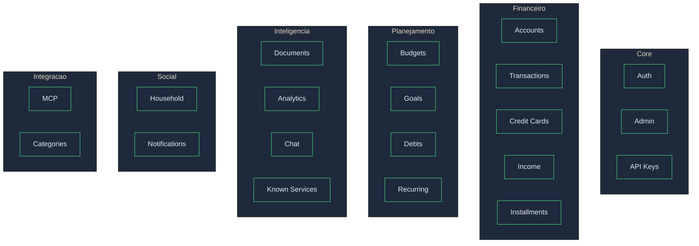

# Modulos do Backend

O backend esta organizado em 20 modulos independentes, cada um responsavel por uma area de funcionalidade.

## Visao Geral

---

## 1. Auth

**Responsabilidade:** Autenticacao e gestao de usuarios

**Funcionalidades:**
- Login com email/senha
- Registro via convite
- Refresh de tokens JWT
- Reset de senha
- Alteracao de senha
- Perfil do usuario

**Endpoints:**
| Metodo | Rota | Descricao |
|--------|------|-----------|
| POST | `/auth/login` | Login |
| POST | `/auth/register/invite/{token}` | Registro via convite |
| POST | `/auth/refresh` | Refresh token |
| POST | `/auth/logout` | Logout |
| POST | `/auth/password-reset` | Solicitar reset |
| POST | `/auth/password-reset/{token}` | Executar reset |
| PUT | `/auth/change-password` | Alterar senha |

---

## 2. Accounts

**Responsabilidade:** Gestao de contas bancarias e carteiras

**Funcionalidades:**
- CRUD de contas
- Tipos: `wallet`, `bank`, `credit_card`, `investment`
- Calculo automatico de saldo
- Suporte a `ownership_type` (personal/household)

**Endpoints:**
| Metodo | Rota | Descricao |
|--------|------|-----------|
| GET | `/accounts` | Listar contas |
| POST | `/accounts` | Criar conta |
| PUT | `/accounts/{id}` | Atualizar conta |
| DELETE | `/accounts/{id}` | Excluir conta |

---

## 3. Transactions

**Responsabilidade:** Gestao de transacoes financeiras

**Funcionalidades:**
- CRUD de transacoes
- Tipos: `income`, `expense`, `transfer`
- Suporte a parcelamentos
- Deteccao de duplicatas
- Confirmacao de itens extraidos de documentos
- Transferencias entre contas (cria 2 transacoes linkadas)

**Regras de Negocio:**
- Duplicata: `description + amount + date + user_id`
- Transferencias excluidas de totais de receita/despesa
- Transacoes projetadas (`is_paid=false`) sao confirmadas quando PDF real chega

**Endpoints:**
| Metodo | Rota | Descricao |
|--------|------|-----------|
| GET | `/transactions` | Listar com filtros |
| POST | `/transactions` | Criar transacao |
| PUT | `/transactions/{id}` | Atualizar |
| DELETE | `/transactions/{id}` | Excluir |
| POST | `/transactions/confirm` | Confirmar de documento |
| POST | `/transactions/batch-confirm` | Confirmar em lote |

---

## 4. Documents

**Responsabilidade:** Upload e processamento de documentos

**Funcionalidades:**
- Upload de PDF, imagens, CSV, Excel
- Extracao automatica via LLM Vision
- Multi-provider (Google, OpenAI, Anthropic, Mistral)
- Deteccao de parcelamentos
- Identificacao de servicos recorrentes

**Fluxo:**
1. Upload do arquivo
2. Processamento com LLM Vision
3. Retorno de itens extraidos
4. Confirmacao pelo usuario

**Endpoints:**
| Metodo | Rota | Descricao |
|--------|------|-----------|
| POST | `/documents` | Upload |
| GET | `/documents` | Listar |
| GET | `/documents/{id}` | Obter |
| POST | `/documents/{id}/retry` | Reprocessar |
| DELETE | `/documents/{id}` | Excluir |

---

## 5. Credit Cards

**Responsabilidade:** Gestao de cartoes de credito

**Funcionalidades:**
- CRUD de cartoes
- Templates pre-definidos por banco
- Configuracao de dia de fechamento e vencimento
- Calculo de limite disponivel
- Recalculo de faturas

**Endpoints:**
| Metodo | Rota | Descricao |
|--------|------|-----------|
| GET | `/credit-cards` | Listar |
| POST | `/credit-cards` | Criar |
| PUT | `/credit-cards/{id}` | Atualizar |
| DELETE | `/credit-cards/{id}` | Excluir |
| POST | `/credit-cards/{id}/recalculate` | Recalcular faturas |

---

## 6. Invoices (Faturas)

**Responsabilidade:** Gestao de faturas de cartao de credito

**Funcionalidades:**
- Listagem por cartao/status
- Pagamento de fatura
- Calculo automatico de periodo
- Status: `open`, `closed`, `paid`, `partial`, `overdue`

**Regras de Negocio:**
- Pagamento nao pode ser com cartao de credito
- Fatura calculada pelo `closing_day` do cartao
- Analytics exclui `payment_transaction_id`

**Endpoints:**
| Metodo | Rota | Descricao |
|--------|------|-----------|
| GET | `/invoices` | Listar |
| GET | `/invoices/{id}` | Obter com transacoes |
| POST | `/invoices/{id}/pay` | Pagar |
| PUT | `/invoices/update-statuses` | Atualizar status (batch) |

---

## 7. Budgets

**Responsabilidade:** Orcamento mensal

**Funcionalidades:**
- Criacao de orcamento por mes
- Itens por categoria
- Comparativo planejado vs realizado
- Copia entre meses

**Endpoints:**
| Metodo | Rota | Descricao |
|--------|------|-----------|
| GET | `/budgets/{year}/{month}` | Obter orcamento |
| POST | `/budgets/{year}/{month}/items` | Adicionar item |
| PUT | `/budgets/{year}/{month}/items/{id}` | Atualizar item |
| POST | `/budgets/copy` | Copiar de outro mes |

---

## 8. Goals

**Responsabilidade:** Metas financeiras

**Funcionalidades:**
- Tipos: poupanca, emergencia, quitacao, investimento
- Contribuicoes e projecoes
- Calculo de fundo de emergencia (Dave Ramsey)
- Calculo de PNIF (Gustavo Cerbasi)

**Endpoints:**
| Metodo | Rota | Descricao |
|--------|------|-----------|
| GET | `/goals` | Listar |
| POST | `/goals` | Criar |
| PUT | `/goals/{id}` | Atualizar |
| DELETE | `/goals/{id}` | Excluir |
| POST | `/goals/{id}/contribute` | Adicionar contribuicao |
| GET | `/goals/emergency-fund` | Calcular fundo emergencia |
| GET | `/goals/pnif` | Calcular PNIF |

---

## 9. Debts

**Responsabilidade:** Gestao de dividas

**Funcionalidades:**
- Cadastro com juros e parcelas
- Estrategia Snowball (menor saldo primeiro)
- Estrategia Avalanche (maior juros primeiro)
- Comparativo de estrategias

**Endpoints:**
| Metodo | Rota | Descricao |
|--------|------|-----------|
| GET | `/debts` | Listar |
| POST | `/debts` | Criar |
| PUT | `/debts/{id}` | Atualizar |
| DELETE | `/debts/{id}` | Excluir |
| POST | `/debts/{id}/payment` | Registrar pagamento |
| GET | `/debts/snowball` | Estrategia Snowball |
| GET | `/debts/avalanche` | Estrategia Avalanche |

---

## 10. Recurring

**Responsabilidade:** Transacoes recorrentes

**Funcionalidades:**
- Criacao de recorrentes
- Frequencias: daily, weekly, monthly, yearly
- Geracao de transacoes futuras
- Deteccao automatica de padroes

**Endpoints:**
| Metodo | Rota | Descricao |
|--------|------|-----------|
| GET | `/recurring` | Listar |
| POST | `/recurring` | Criar |
| PUT | `/recurring/{id}` | Atualizar |
| DELETE | `/recurring/{id}` | Excluir |
| POST | `/recurring/{id}/pause` | Pausar |
| POST | `/recurring/{id}/resume` | Retomar |
| POST | `/recurring/{id}/generate` | Gerar transacoes |

---

## 11. Analytics

**Responsabilidade:** Analise financeira e insights

**Funcionalidades:**
- Resumo mensal (receitas, despesas, saldo)
- Insights automaticos (vazamentos, oportunidades)
- Gastos por categoria
- Tendencias

**Regras de Negocio:**
- Exclui pagamentos de fatura dos totais
- Exclui transferencias dos totais

**Endpoints:**
| Metodo | Rota | Descricao |
|--------|------|-----------|
| GET | `/analytics/monthly` | Resumo do mes |
| GET | `/analytics/insights` | Insights financeiros |

---

## 12. Chat

**Responsabilidade:** Assistente financeiro IA

**Funcionalidades:**
- Chat com contexto financeiro
- Sugestoes de perguntas
- Analise de gastos
- Recomendacoes

**Endpoints:**
| Metodo | Rota | Descricao |
|--------|------|-----------|
| POST | `/chat/message` | Enviar mensagem |
| GET | `/chat/suggestions` | Obter sugestoes |

---

## 13. Income

**Responsabilidade:** Fontes de renda

**Funcionalidades:**
- Cadastro de fontes de renda
- Tipos: salario, freelance, investimento, etc.
- Frequencia e dia de pagamento
- Geracao de transacoes

**Endpoints:**
| Metodo | Rota | Descricao |
|--------|------|-----------|
| GET | `/income-sources` | Listar |
| POST | `/income-sources` | Criar |
| PUT | `/income-sources/{id}` | Atualizar |
| DELETE | `/income-sources/{id}` | Excluir |
| POST | `/income-sources/{id}/generate` | Gerar transacao |

---

## 14. Installments

**Responsabilidade:** Series de parcelamento

**Funcionalidades:**
- Criacao de series
- Geracao de parcelas futuras
- Match de parcelas com PDFs
- Calculo de status (active, completed, cancelled)

**Regras de Negocio:**
- Match usa tolerancia de 5% no valor e ±45 dias na data
- Limite maximo de 48 parcelas recomendado

---

## 15. Household

**Responsabilidade:** Gestao familiar

**Funcionalidades:**
- Convite de membros por email
- Compartilhamento de contas e transacoes
- Controle de permissoes
- Migracao de dados pessoais

**Endpoints:**
| Metodo | Rota | Descricao |
|--------|------|-----------|
| GET | `/family/context` | Obter contexto |
| GET | `/family/members` | Listar membros |
| POST | `/family/invite` | Convidar |
| DELETE | `/family/members/{id}` | Remover membro |

---

## 16. Admin

**Responsabilidade:** Funcoes administrativas

**Funcionalidades:**
- Dashboard de metricas
- Gestao de usuarios
- Gestao de licencas
- Criacao de convites

**Endpoints (requer role admin):**
| Metodo | Rota | Descricao |
|--------|------|-----------|
| GET | `/admin/dashboard` | Dashboard |
| GET | `/admin/users` | Listar usuarios |
| POST | `/admin/licenses` | Criar licenca |
| POST | `/admin/invites` | Criar convite |

---

## 17. API Keys

**Responsabilidade:** Chaves de API para integracoes

**Funcionalidades:**
- Criacao de API keys
- Revogacao
- Listagem

**Endpoints:**
| Metodo | Rota | Descricao |
|--------|------|-----------|
| GET | `/api-keys` | Listar |
| POST | `/api-keys` | Criar |
| DELETE | `/api-keys/{id}` | Revogar |

---

## 18. MCP

**Responsabilidade:** Model Context Protocol

**Funcionalidades:**
- Integracao com Claude Code
- Integracao com ChatGPT Custom GPT
- Acesso aos dados financeiros via MCP

---

## 19. Known Services

**Responsabilidade:** Catalogo de servicos conhecidos

**Funcionalidades:**
- Lista de servicos recorrentes (Netflix, Spotify, etc.)
- Patterns para deteccao automatica
- Categorias e frequencias padrao

---

## 20. Categories

**Responsabilidade:** Categorias de transacoes

**Funcionalidades:**
- Categorias do sistema (padrao)
- Categorias do usuario (personalizadas)
- Hierarquia (subcategorias)

**Endpoints:**
| Metodo | Rota | Descricao |
|--------|------|-----------|
| GET | `/categories` | Listar (sistema + usuario) |
| POST | `/categories` | Criar personalizada |
| PUT | `/categories/{id}` | Atualizar |
| DELETE | `/categories/{id}` | Excluir |
